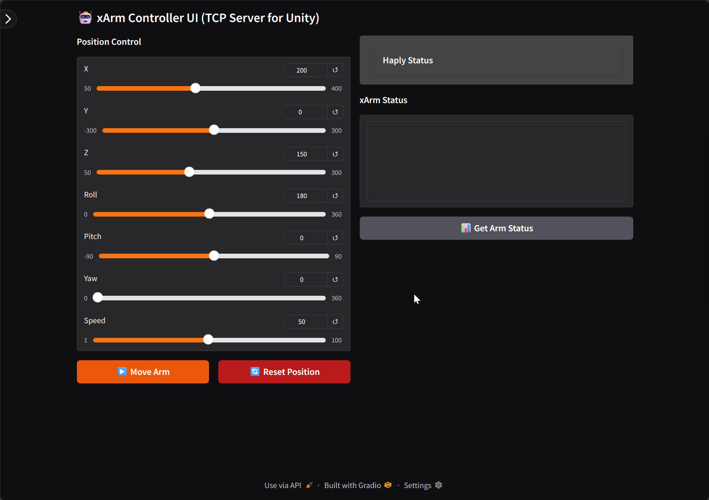

# Project Midas

A robotic control system that provides a web-based interface for controlling xArm robots with TCP server integration for external applications (like Unity).

## 🌟 Features
<p align="center">
  
</p>
<p align="center"><em>Project Midas web interface</em></p>

- **Web-based Control Interface**: Gradio-powered UI for intuitive robot arm control
- **TCP Server**: Network interface for external applications to communicate with the robot
- **Position Control**: Cartesian coordinate control (X, Y, Z) with orientation (Roll, Pitch, Yaw)
- **Safety Features**: Built-in error handling, state checking, and safe reset functionality
- **Real-time Monitoring**: Debug logging and arm status monitoring
- **Configurable Settings**: Adjustable TCP server settings and robot parameters

## 📋 Requirements

- Python 3.13.9
- xArm robot (configured at default IP: `192.168.1.188`)
- Network connectivity to the robot

## 🔧 Installation

1. Clone the repository:
```bash
git clone <repository-url>
cd ProjectMidas
```

2. Create and activate a virtual environment:
```shell script
python -m venv .venv
source .venv/bin/activate  # On Windows: .venv\Scripts\activate
```

3. Install dependencies:
```shell script
pip install -r requirements.txt
```

Required packages:
- gradio
- xarm-python-sdk
- Additional standard libraries (socket, threading, json)

## 🚀 Usage
### Starting the Application

Run the main server application:
```shell script
python robot_server_app.py
```

The application will start:
- **Web UI**: Available at `http://localhost:9080`
- **TCP Server**: Listening on port `5005` for external connections

### Web Interface

The Gradio interface provides:

1. **Position Control Sliders**:
   - X, Y, Z coordinates
   - Roll, Pitch, Yaw orientation
   - Speed adjustment

2. **Control Buttons**:
   - **Move Arm**: Execute movement to specified position
   - **Reset Position**: Return to safe default position (250, 0, 150)
   - **Get Arm Status**: Check current robot state

3. **Settings Panel** (Collapsible Sidebar):
   - TCP server configuration
   - Robot IP address
   - Default movement speed
   - Debug log toggle

### TCP Server Commands

External applications can send JSON commands to the TCP server (port 5005):

#### Move Command
```json
{
  "x": 250,
  "y": 0,
  "z": 150,
  "roll": 180,
  "pitch": 0,
  "yaw": 0,
  "speed": 50
}
```


#### Reset Command
```json
{
  "reset": true
}
```

#### Status Query
```json
{
  "status": true
}
```

## 📁 Project Structure

```
ProjectMidas/
├── robot_server_app.py     # Main application with web UI and TCP server
├── haply/                   # Haply device integration scripts
│   ├── haply_controller.py
│   ├── versegrip_to_xarm.py
│   └── ...
├── scripts/                 # Additional utility scripts
│   ├── robot_server.py
│   ├── coordinate_sender.py
│   └── ...
├── .venv/                   # Virtual environment
├── LICENSE                  # Apache License 2.0
└── README.md               # This file
```


## 🛡️ Safety Features

- **Error State Detection**: Automatically detects and reports robot error states
- **Error Recovery**: Built-in error clearing and state reset functionality
- **State Validation**: Checks robot state before executing movements
- **Safe Reset**: Defined safe position for emergency stops

## 🔍 Troubleshooting

### Robot Not Responding
1. Check network connectivity to robot IP
2. Verify robot is powered on and initialized
3. Use the "Reset Position" button to clear error states
4. Check debug log for detailed error messages

### Connection Issues
- Ensure robot IP address is correct in settings
- Verify no firewall blocking TCP port 5005
- Check that only one instance of the application is running

## 📝 License

This project is licensed under the Apache License 2.0 - see the [LICENSE](LICENSE) file for details.

## 🤝 Contributing

Contributions are welcome! Please feel free to submit pull requests or open issues for bugs and feature requests.

## ⚠️ Important Notes

- Always ensure the robot workspace is clear before operation
- Keep emergency stop accessible during robot operation
- Monitor the robot during first-time setup and testing
- Default safe position: X=250, Y=0, Z=150, Roll=180